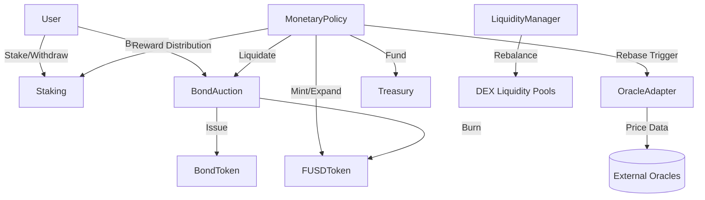

# FUSD Stablecoin Protocol


FUSD is a state-of-the-art stablecoin protocol implemented in Cairo for the Starknet ecosystem. It utilizes an elastic supply model to maintain a $1.00 peg through sophisticated rebase mechanisms, incentivized staking, and innovative bond auctions.

## 🌟 Key Features

- **Elastic Supply (Rebase)**: Automatically expands and contracts supply based on multi-source oracle price data.
- **Protocol-Managed Liquidity**: Native `LiquidityManager` coordinates rebalancing and LP position management.
- **Incentivized Staking**: Users earn inflationary rewards by staking FUSD during expansion phases.
- **Debt Markets**: `BondAuction` and `BondToken` allow users to exchange FUSD for discounted bonds during contraction, effectively removing FUSD from circulation.
- **Robust Security**: Built-in Reentrancy Guards, Access Control, and multi-oracle price validation.

---

## �️ Security Audit & Remediation

The protocol has undergone a comprehensive internal security audit. All critical vulnerabilities have been identified and resolved.

### Audit Summary
| Severity | Status | Mitigation |
| :--- | :--- | :--- |
| **CRITICAL** | ✅ Fixed | Implemented ReentrancyGuard and CEI pattern in BondAuction. |
| **CRITICAL** | ✅ Fixed | Added Supply Cap and circuit-breaker in MonetaryPolicy. |
| **HIGH** | ✅ Fixed | Added slippage protection to Staking and Bond redemption. |
| **HIGH** | ✅ Fixed | Implemented Emergency Oracle override and robust median calculation. |

**Hardenings Added:**
- **Emergency Pause**: Protocol-wide `Pausable` integration across all core contracts.
- **Circuit Breaker**: `MonetaryPolicy` now auto-pauses if price deviations exceed 20%, protecting against oracle crashes.
- **Double Cooldown**: Rebases now require both Time and Block-number progression.
- **ERC20 Protection**: Standardized `increase_allowance` and `decrease_allowance` in FUSD token.

**Full Audit Report:** [AUDIT_REPORT.md](./AUDIT_REPORT.md)

---

## 🚀 Live Deployment (Sepolia Testnet)

The protocol is fully deployed and operational on Starknet Sepolia.

| Contract | Address | Explorer Link |
| :--- | :--- | :--- |
| **FUSD Token** | `0x0a2cbd3a4b2fac3c6702090dfdddf69b429fda459d4a27840c669eb9653245d` | [View on Starkscan](https://sepolia.starkscan.co/contract/0x0a2cbd3a4b2fac3c6702090dfdddf69b429fda459d4a27840c669eb9653245d) |
| **Monetary Policy** | `0x02cd060af8247e53ba20c4e988a6ade3368c32cfb8486dda19058e688e2368f9` | [View on Starkscan](https://sepolia.starkscan.co/contract/0x02cd060af8247e53ba20c4e988a6ade3368c32cfb8486dda19058e688e2368f9) |
| **Staking** | `0x03d516c810ba803a548fbc0ce63f794750ef5125efcdef5404a0080f6808d5fa` | [View on Starkscan](https://sepolia.starkscan.co/contract/0x03d516c810ba803a548fbc0ce63f794750ef5125efcdef5404a0080f6808d5fa) |
| **Bond Auction** | `0x03c02f204d438254821e4127fe8c39327e2126356600efb392676afe50f36558` | [View on Starkscan](https://sepolia.starkscan.co/contract/0x03c02f204d438254821e4127fe8c39327e2126356600efb392676afe50f36558) |
| **Oracle Adapter** | `0x069b531607edc04af27ab099c3ced2827d53bea4e70d160a59e56a146b6d83c0` | [View on Starkscan](https://sepolia.starkscan.co/contract/0x069b531607edc04af27ab099c3ced2827d53bea4e70d160a59e56a146b6d83c0) |
| **Treasury** | `0x07b0097fbfc8a16687d68cbb2667ec48b56c143a47da25ddb90bda1be7ce83e6` | [View on Starkscan](https://sepolia.starkscan.co/contract/0x07b0097fbfc8a16687d68cbb2667ec48b56c143a47da25ddb90bda1be7ce83e6) |
| **Liquidity Manager** | `0x0ab00840455a9bc17adecb5c1eba8b0227e6f33df3b84e1b602d3ac5e1f55f` | [View on Starkscan](https://sepolia.starkscan.co/contract/0x0ab00840455a9bc17adecb5c1eba8b0227e6f33df3b84e1b602d3ac5e1f55f) |
| **Bond Token** | `0x02c7b56faa8dc03072e91db7a45e549920d771f1070ac466e6b5f1c71c07bbeb` | [View on Starkscan](https://sepolia.starkscan.co/contract/0x02c7b56faa8dc03072e91db7a45e549920d771f1070ac466e6b5f1c71c07bbeb) |

---

## 🏗️ Architecture



---

## 🔧 Developer Guide

### Prerequisites
- [Scarb v2.15.0](https://docs.swmansion.com/scarb/download.html)
- Node.js & npm (for deployment scripts)

### Installation
```bash
git clone https://github.com/EmekaIwuagwu/fusd-cairo.git
cd fusd-cairo
scarb build
```

### Running Tests
```bash
scarb test
```

### Deployment (Scripts)
Modify the `.env` file with your credentials and run:
```bash
cd scripts
npm install
node deploy_core.js
```

---

## ⚖️ License
This project is licensed under the MIT License - see the [LICENSE](LICENSE) file for details.
