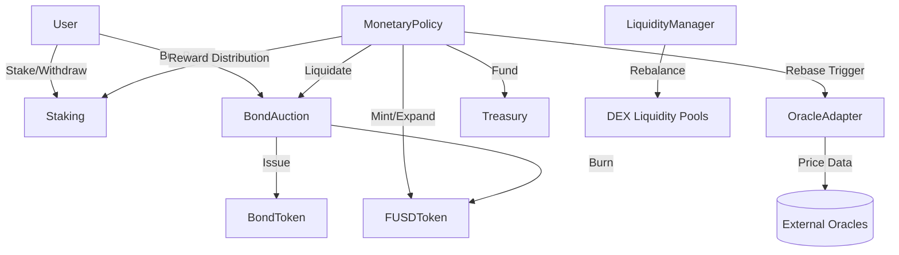

# FUSD Algorithmic Stablecoin Protocol


FUSD is a state-of-the-art algorithmic stablecoin protocol implemented in Cairo for the Starknet ecosystem. It utilizes an elastic supply model to maintain a $1.00 peg through sophisticated rebase mechanisms, incentivized staking, and innovative bond auctions.

## 🌟 Key Features

- **Elastic Supply (Rebase)**: Automatically expands and contracts supply based on multi-source oracle price data.
- **Protocol-Managed Liquidity**: Native `LiquidityManager` coordinates rebalancing and LP position management.
- **Incentivized Staking**: Users earn inflationary rewards by staking FUSD during expansion phases.
- **Debt Markets**: `BondAuction` and `BondToken` allow users to exchange FUSD for discounted bonds during contraction, effectively removing FUSD from circulation.
- **Robust Security**: Built-in Reentrancy Guards, Access Control, and multi-oracle price validation.

---

## �️ Security Audit & Remediation

The protocol has undergone a comprehensive internal security audit. All critical vulnerabilities have been identified and resolved.

### Audit Summary
| Severity | Status | Mitigation |
| :--- | :--- | :--- |
| **CRITICAL** | ✅ Fixed | Implemented ReentrancyGuard and CEI pattern in BondAuction. |
| **CRITICAL** | ✅ Fixed | Added Supply Cap and epoch-based minting limits in MonetaryPolicy. |
| **HIGH** | ✅ Fixed | Added slippage protection to Staking reward claims. |
| **HIGH** | ✅ Fixed | Implemented administrative tunables for Oracle staleness and deviation. |

**Full Audit Report:** [AUDIT_REPORT.md](./AUDIT_REPORT.md)

---

## 🚀 Live Deployment (Sepolia Testnet)

The protocol is fully deployed and operational on Starknet Sepolia.

| Contract | Address | Explorer Link |
| :--- | :--- | :--- |
| **FUSD Token** | `0x06c57ed02a697c5bf7b82b43635d56f7308e0debdb20fd961086fccde27af0b7` | [View on Starkscan](https://sepolia.starkscan.co/contract/0x06c57ed02a697c5bf7b82b43635d56f7308e0debdb20fd961086fccde27af0b7) |
| **Monetary Policy** | `0x04736b65c8dfaaed3ee18eaa035fc42c8cbdd8b9a67c7c381d840500f6e31e8a` | [View on Starkscan](https://sepolia.starkscan.co/contract/0x04736b65c8dfaaed3ee18eaa035fc42c8cbdd8b9a67c7c381d840500f6e31e8a) |
| **Staking** | `0x01df773bc19e6d5a3dcae176219dedcea5307e17ca43eb97b7d8926fb45209b4` | [View on Starkscan](https://sepolia.starkscan.co/contract/0x01df773bc19e6d5a3dcae176219dedcea5307e17ca43eb97b7d8926fb45209b4) |
| **Bond Auction** | `0x03f5ef1d26b5e8e5c046ee10c3b17aff8e0ad8cfe9d3262ea6a390ad43c7dd1a` | [View on Starkscan](https://sepolia.starkscan.co/contract/0x03f5ef1d26b5e8e5c046ee10c3b17aff8e0ad8cfe9d3262ea6a390ad43c7dd1a) |
| **Oracle Adapter** | `0x0bff37bf7c1736537991d0c865c229c689f8817e9c0ec226519d6f66f05cd88` | [View on Starkscan](https://sepolia.starkscan.co/contract/0x0bff37bf7c1736537991d0c865c229c689f8817e9c0ec226519d6f66f05cd88) |
| **Treasury** | `0x05c048706b4f9c935c801f40cb046acb12b990e3e6a0e9332c8b951f2945b899` | [View on Starkscan](https://sepolia.starkscan.co/contract/0x05c048706b4f9c935c801f40cb046acb12b990e3e6a0e9332c8b951f2945b899) |
| **Liquidity Manager** | `0x0320688ad4fb61fae6d60f06aa9a12d2518afde7b8796810b2ae821f70d0b406` | [View on Starkscan](https://sepolia.starkscan.co/contract/0x0320688ad4fb61fae6d60f06aa9a12d2518afde7b8796810b2ae821f70d0b406) |
| **Bond Token** | `0x0141614a0fa5a0bb5591e4906e03932f81c2b0cb1ff4e3848593c9590f7e1466` | [View on Starkscan](https://sepolia.starkscan.co/contract/0x0141614a0fa5a0bb5591e4906e03932f81c2b0cb1ff4e3848593c9590f7e1466) |

---

## 🏗️ Architecture



---

## 🔧 Developer Guide

### Prerequisites
- [Scarb v2.15.0](https://docs.swmansion.com/scarb/download.html)
- Node.js & npm (for deployment scripts)

### Installation
```bash
git clone https://github.com/EmekaIwuagwu/fusd-cairo.git
cd fusd-cairo
scarb build
```

### Running Tests
```bash
scarb test
```

### Deployment (Scripts)
Modify the `.env` file with your credentials and run:
```bash
cd scripts
npm install
node deploy_core.js
```

---

## ⚖️ License
This project is licensed under the MIT License - see the [LICENSE](LICENSE) file for details.
